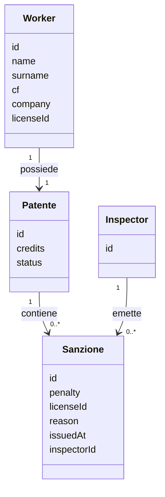

# Modello di dominio

## Obiettivo

Il dominio di WorksiteID rappresenta la patente a crediti associata a un lavoratore e le sanzioni che ne modificano lo stato.

Il modello è indipendente dalle tecnologie utilizzate per autenticazione, persistenza e blockchain.

## Entità

### Worker

Rappresenta il lavoratore a cui è associata una patente.

- `id` — identificativo univoco del lavoratore
- `name` — nome del lavoratore
- `surname` — cognome del lavoratore
- `cf` — codice fiscale
- `company` — impresa di appartenenza
- `licenseId` — identificativo della patente associata

### Inspector

Rappresenta l'ispettore che opera nel sistema e che può emettere sanzioni.

- `id` — identificativo univoco dell'ispettore

L'Inspector rappresenta un'identità applicativa. Le modalità di autenticazione dell'ispettore non fanno parte del modello di dominio e saranno definite nelle issue successive.

### Patente

Rappresenta la patente a crediti del lavoratore.

- `id` — identificativo univoco della patente
- `credits` — numero corrente di crediti
- `status` — stato corrente della patente

La patente viene creata con **30 crediti** e stato `ACTIVE`.

### Sanzione

Rappresenta una penalizzazione applicata alla patente.

- `id` — identificativo della sanzione
- `penalty` — numero di crediti da sottrarre
- `licenseId` — identificativo della patente a cui è associata
- `reason` — motivazione della sanzione
- `issuedAt` — momento di emissione
- `inspectorId` — identificativo dell'ispettore che ha emesso la sanzione

Non vengono definite tipologie specifiche di sanzione in questa versione del progetto.
Ogni sanzione è associata alla patente a cui viene applicata e all'ispettore che l'ha emessa.

## Relazioni

Ogni lavoratore possiede una patente e una patente può avere zero o più sanzioni.  
I dati anagrafici del Worker appartengono al dominio applicativo e non implicano che vengano memorizzati sulla blockchain o inclusi nei dati utilizzati per la generazione dei commitment.
## Regole di dominio

### Crediti iniziali

Ogni nuova patente viene inizializzata con:

* `30` crediti
* stato `ACTIVE`

### Applicazione di una sanzione

L'applicazione di una sanzione riduce il numero di crediti della patente del valore indicato da `penalty`.

Una sanzione deve avere una penalizzazione maggiore di zero.

I crediti non possono diventare negativi. Se la penalizzazione supera i crediti disponibili, il valore viene portato a `0`.

L'applicazione della sanzione viene registrata nello storico della patente.

### Revoca

Quando i crediti diventano inferiori a `15`, la patente passa allo stato `REVOKED`.

La soglia è quindi:

* `credits >= 15` → `ACTIVE`
* `credits < 15` → `REVOKED`

Una patente `REVOKED` non può tornare `ACTIVE` nella versione attuale del progetto.

Non vengono implementati meccanismi di recupero o reintegro dei crediti.

## Stato della patente

Gli stati possibili sono:

* `ACTIVE`
* `REVOKED`

Lo stato rappresenta esclusivamente la condizione corrente della patente.

Il risultato della futura verifica al varco è invece un concetto distinto:

* `PASS`
* `NOT_PASS`

`PASS` e `NOT_PASS` non sono quindi stati della patente.

## Verifica al varco

La verifica al varco sarà implementata nelle issue successive.

Il Worker potrà fornire una prova ZKP attraverso una stringa che verrà inviata a un endpoint di verifica.

L'endpoint restituirà un esito:

* `PASS` — la verifica è stata superata;
* `NOT_PASS` — la verifica non è stata superata.

## Credenziali WebAuthn

Una credenziale WebAuthn rappresenta la credenziale utilizzata da un Worker o da un Inspector per autenticarsi tramite passkey.

Una credenziale contiene:

- `id` — identificativo univoco della credenziale
- `userId` — identificativo dell'utente a cui appartiene
- `userType` — tipo di utente (`WORKER` o `INSPECTOR`)
- `publicKey` — chiave pubblica associata alla credenziale
- `counter` — contatore utilizzato per il controllo delle autenticazioni

Ogni utente può avere una sola credenziale WebAuthn nella versione attuale del progetto.

Il `counter` viene aggiornato durante un'autenticazione riuscita e non può diminuire.

Le credenziali WebAuthn sono utilizzate esclusivamente per l'autenticazione dell'identità applicativa e non rappresentano lo stato della patente a crediti.

## Autenticazione WebAuthn

L'autenticazione tramite WebAuthn è composta da due fasi.

### Registrazione

La registrazione di una credenziale segue il seguente flusso:

1. verifica dell'esistenza dell'utente;
2. verifica dell'assenza di una credenziale già registrata;
3. generazione delle `RegistrationOptions`;
4. generazione e memorizzazione del challenge;
5. ricezione della risposta WebAuthn;
6. verifica della risposta;
7. creazione e persistenza della credenziale;
8. eliminazione del challenge.

### Autenticazione

L'autenticazione segue il seguente flusso:

1. verifica dell'esistenza dell'utente;
2. recupero della credenziale WebAuthn;
3. generazione delle `AuthenticationOptions`;
4. generazione e memorizzazione del challenge;
5. ricezione della risposta WebAuthn;
6. verifica della risposta;
7. aggiornamento del counter della credenziale;
8. eliminazione del challenge.

Un challenge non può essere riutilizzato dopo il completamento della relativa operazione.