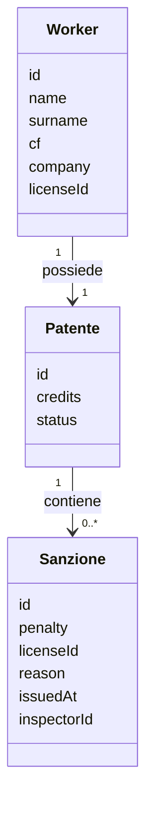

# Modello di dominio

## Obiettivo

Il dominio di WorksiteID rappresenta la patente a crediti associata a un lavoratore e le sanzioni che ne modificano lo stato.

Il modello è indipendente dalle tecnologie utilizzate per autenticazione, persistenza e blockchain.

## Entità

### Worker

Rappresenta il lavoratore a cui è associata una patente.

- `id` — identificativo univoco del lavoratore
- `name` — nome del lavoratore
- `surname` — cognome del lavoratore
- `cf` — codice fiscale
- `company` — impresa di appartenenza
- `licenseId` — identificativo della patente associata

### Patente

Rappresenta la patente a crediti del lavoratore.

- `id` — identificativo univoco della patente
- `credits` — numero corrente di crediti
- `status` — stato corrente della patente

La patente viene creata con **30 crediti** e stato `ACTIVE`.

### Sanzione

Rappresenta una penalizzazione applicata alla patente.

- `id` — identificativo della sanzione
- `penalty` — numero di crediti da sottrarre
- `licenseId` — identificativo della patente a cui è associata
- `reason` — motivazione della sanzione
- `issuedAt` — momento di emissione
- `inspectorId` — identificativo dell'ispettore che ha emesso la sanzione

Non vengono definite tipologie specifiche di sanzione in questa versione del progetto.

## Relazioni

Ogni lavoratore possiede una patente e una patente può avere zero o più sanzioni.  
I dati anagrafici del Worker appartengono al dominio applicativo e non implicano che vengano memorizzati sulla blockchain o inclusi nei dati utilizzati per la generazione dei commitment.
## Regole di dominio

### Crediti iniziali

Ogni nuova patente viene inizializzata con:

* `30` crediti
* stato `ACTIVE`

### Applicazione di una sanzione

L'applicazione di una sanzione riduce il numero di crediti della patente del valore indicato da `penalty`.

Una sanzione deve avere una penalizzazione maggiore di zero.

I crediti non possono diventare negativi. Se la penalizzazione supera i crediti disponibili, il valore viene portato a `0`.

L'applicazione della sanzione viene registrata nello storico della patente.

### Revoca

Quando i crediti diventano inferiori a `15`, la patente passa allo stato `REVOKED`.

La soglia è quindi:

* `credits >= 15` → `ACTIVE`
* `credits < 15` → `REVOKED`

Una patente `REVOKED` non può tornare `ACTIVE` nella versione attuale del progetto.

Non vengono implementati meccanismi di recupero o reintegro dei crediti.

## Stato della patente

Gli stati possibili sono:

* `ACTIVE`
* `REVOKED`

Lo stato rappresenta esclusivamente la condizione corrente della patente.

Il risultato della futura verifica al varco è invece un concetto distinto:

* `PASS`
* `NOT_PASS`

`PASS` e `NOT_PASS` non sono quindi stati della patente.

## Verifica al varco

La verifica al varco sarà implementata nelle issue successive.

Il Worker potrà fornire una prova ZKP attraverso una stringa che verrà inviata a un endpoint di verifica.

L'endpoint restituirà un esito:

* `PASS` — la verifica è stata superata;
* `NOT_PASS` — la verifica non è stata superata.